# Claude Skills

A collection of statuslines, slash commands, sub-agents and other useful skills for [Claude Code](https://docs.anthropic.com/en/docs/claude-code).

## Install

```sh
curl -fsSL https://raw.githubusercontent.com/mousedown/claude-skills/main/install.sh | bash -s <theme>
```

Replace `<theme>` with any theme name from the gallery below.

---

## Gallery

<table>
<tr>
<td align="center" width="50%">

### minimal
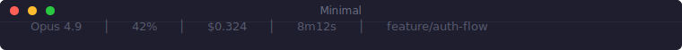

```sh
curl -fsSL https://raw.githubusercontent.com/mousedown/claude-skills/main/install.sh | bash -s minimal
```

</td>
<td align="center" width="50%">

### compact
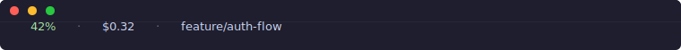

```sh
curl -fsSL https://raw.githubusercontent.com/mousedown/claude-skills/main/install.sh | bash -s compact
```

</td>
</tr>
<tr>
<td align="center" width="50%">

### plain
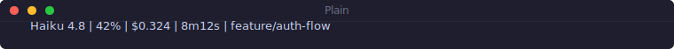

```sh
curl -fsSL https://raw.githubusercontent.com/mousedown/claude-skills/main/install.sh | bash -s plain
```

</td>
<td align="center" width="50%">

### emoji
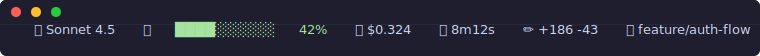

```sh
curl -fsSL https://raw.githubusercontent.com/mousedown/claude-skills/main/install.sh | bash -s emoji
```

</td>
</tr>
<tr>
<td align="center" width="50%">

### zen
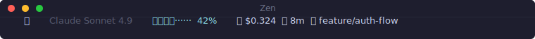

```sh
curl -fsSL https://raw.githubusercontent.com/mousedown/claude-skills/main/install.sh | bash -s zen
```

</td>
<td align="center" width="50%">

### neon-tokyo
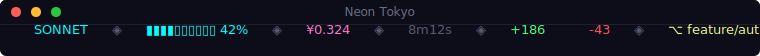

```sh
curl -fsSL https://raw.githubusercontent.com/mousedown/claude-skills/main/install.sh | bash -s neon-tokyo
```

</td>
</tr>
<tr>
<td align="center" width="50%">

### retro-terminal


```sh
curl -fsSL https://raw.githubusercontent.com/mousedown/claude-skills/main/install.sh | bash -s retro-terminal
```

</td>
<td align="center" width="50%">

### hacker-matrix
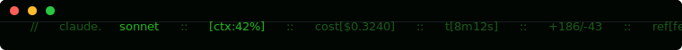

```sh
curl -fsSL https://raw.githubusercontent.com/mousedown/claude-skills/main/install.sh | bash -s hacker-matrix
```

</td>
</tr>
<tr>
<td align="center" width="50%">

### scoreboard
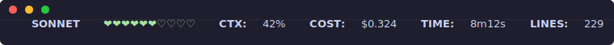

```sh
curl -fsSL https://raw.githubusercontent.com/mousedown/claude-skills/main/install.sh | bash -s scoreboard
```

</td>
<td align="center" width="50%">

### time-machine
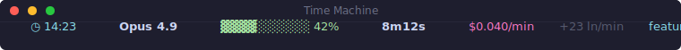

```sh
curl -fsSL https://raw.githubusercontent.com/mousedown/claude-skills/main/install.sh | bash -s time-machine
```

</td>
</tr>
<tr>
<td align="center" width="50%">

### budget-tracker
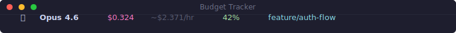

```sh
curl -fsSL https://raw.githubusercontent.com/mousedown/claude-skills/main/install.sh | bash -s budget-tracker
```

</td>
<td align="center" width="50%">

### git-dashboard
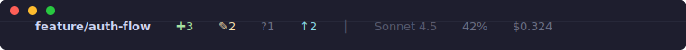

```sh
curl -fsSL https://raw.githubusercontent.com/mousedown/claude-skills/main/install.sh | bash -s git-dashboard
```

</td>
</tr>
<tr>
<td align="center" width="50%">

### tokens-focus
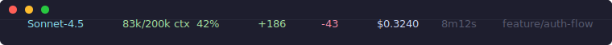

```sh
curl -fsSL https://raw.githubusercontent.com/mousedown/claude-skills/main/install.sh | bash -s tokens-focus
```

</td>
<td align="center" width="50%">

### powerline-arrows
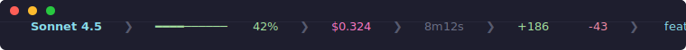

```sh
curl -fsSL https://raw.githubusercontent.com/mousedown/claude-skills/main/install.sh | bash -s powerline-arrows
```

</td>
</tr>
<tr>
<td align="center" width="50%">

### powerline-classic


```sh
curl -fsSL https://raw.githubusercontent.com/mousedown/claude-skills/main/install.sh | bash -s powerline-classic
```

</td>
<td align="center" width="50%">

### powerline-neon


```sh
curl -fsSL https://raw.githubusercontent.com/mousedown/claude-skills/main/install.sh | bash -s powerline-neon
```

</td>
</tr>
<tr>
<td align="center" width="50%">

### powerline-gruvbox
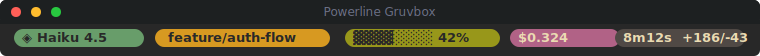

```sh
curl -fsSL https://raw.githubusercontent.com/mousedown/claude-skills/main/install.sh | bash -s powerline-gruvbox
```

</td>
<td align="center" width="50%">

### powerline-nord


```sh
curl -fsSL https://raw.githubusercontent.com/mousedown/claude-skills/main/install.sh | bash -s powerline-nord
```

</td>
</tr>
<tr>
<td align="center" width="50%">

### powerline-catppuccin
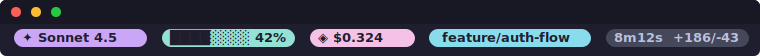

```sh
curl -fsSL https://raw.githubusercontent.com/mousedown/claude-skills/main/install.sh | bash -s powerline-catppuccin
```

</td>
<td align="center" width="50%">

### cost-tracker
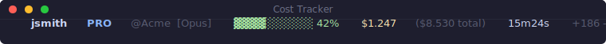

```sh
curl -fsSL https://raw.githubusercontent.com/mousedown/claude-skills/main/install.sh | bash -s cost-tracker
```

</td>
</tr>
<tr>
<td align="center" width="50%">

### gsd
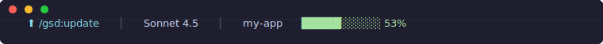

```sh
curl -fsSL https://raw.githubusercontent.com/mousedown/claude-skills/main/install.sh | bash -s gsd
```

</td>
<td align="center" width="50%">

### centered
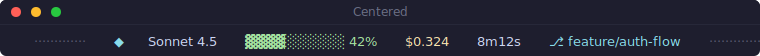

```sh
curl -fsSL https://raw.githubusercontent.com/mousedown/claude-skills/main/install.sh | bash -s centered
```

</td>
</tr>
<tr>
<td align="center" width="50%">

### lcars


```sh
curl -fsSL https://raw.githubusercontent.com/mousedown/claude-skills/main/install.sh | bash -s lcars
```

</td>
<td align="center" width="50%">

### solarized
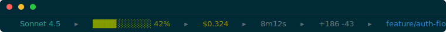

```sh
curl -fsSL https://raw.githubusercontent.com/mousedown/claude-skills/main/install.sh | bash -s solarized
```

</td>
</tr>
<tr>
<td align="center" width="50%">

### split-view
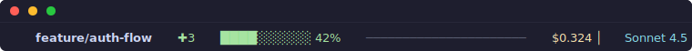

```sh
curl -fsSL https://raw.githubusercontent.com/mousedown/claude-skills/main/install.sh | bash -s split-view
```

</td>
<td align="center" width="50%">

### two-line
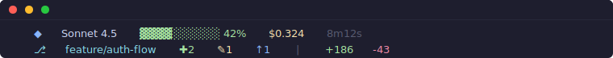

```sh
curl -fsSL https://raw.githubusercontent.com/mousedown/claude-skills/main/install.sh | bash -s two-line
```

</td>
</tr>
</table>

---

## Choosing a Statusline

| If you want... | Use |
|---|---|
| Least distraction | compact or plain |
| Clean but informative | minimal |
| Actual token numbers | tokens-focus |
| Track spending closely | budget-tracker or cost-tracker |
| Git status at a glance | git-dashboard or split-view |
| Fun / expressive | emoji or zen |
| Retro / hacker feel | hacker-matrix or retro-terminal |
| Sci-fi / themed | lcars or neon-tokyo |
| Neon / cyberpunk | neon-tokyo or powerline-neon |
| Long session timing | time-machine |
| Wide terminal, centered | centered |
| Info density, no width | two-line |
| Familiar color scheme | solarized |
| Powerline (no Nerd Fonts) | powerline-arrows |
| Powerline + Nerd Fonts | powerline-classic, powerline-gruvbox, powerline-nord, or powerline-catppuccin |
| GSD workflow | gsd |
